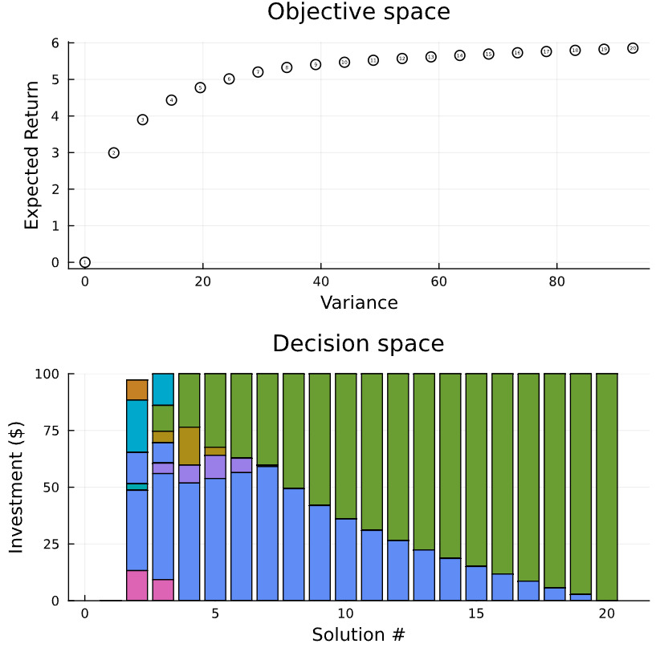

Synopsis:
This project aims to modify traditional mathematical optimization based
equity portfolio allocation techniques, which evaluate risk-reward fronts
using empirical pricing data by evaluating risk instead via European call option pricing
(calculated via the Bachelier model)
based implied volatility estimations (see DeMiguel et. al., 2010) with
shares included in the NSE NIFTY 50 index.

A comparative study is done to find differences in realized returns in both
short-term and long-term scenarios with implied volatility based decisions
as compared to traditional historical-facing risk analysis methods like
continuous variance-at-risk (cVaR).

For an at-the-money option (i.e. strike price equals asset's market price)
σ = C/S * √(2/(πT))
where σ is the implied volatility

C is the option price (Option Premium)

S is the spot price

T is time to maturity

[TODO] Backtesting and Comparative Analysis
